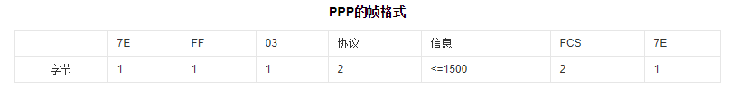
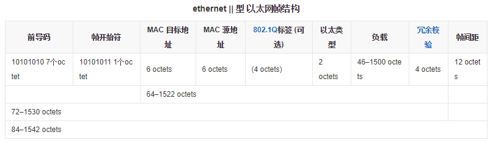
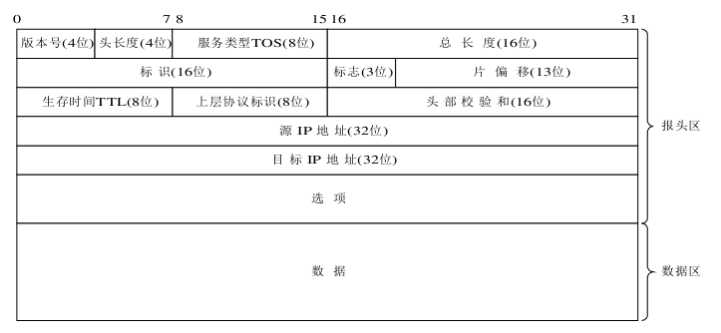

# 概述

## 因特网的组成

从功能上划分有边缘部分和核心部分，边缘部分由所有连接在因特网的主机组成，这部分是用户直接使用的；而核心部分就是由大量连接这些网络的路由器组成。这部分是为边缘部分提供服务的

网络的边缘部分的主机也有被不正式的划分为客户机（Client）和服务器（Server）

网络的核心部分起特殊作用的就是路由器，它是一种专用计算机，但不是主机。路由器是实现分组交换的关键构件，其任务是转发收到的分组。

**电路交换**
在电话问世不久后就发现，让两两电话之间都相连是不现实的事情，于是有了交换机，两个电话要连接就通过交换机来相连。这就是一种称为电路交换的方式。
其过程就是建立连接（分配资源）----通话------释放连接（归还所占的资源）。

但是计算机可不是这样的，建立了连接不一定在不停的传输数据，所以这样的传输效率很低，宝贵的通信资源利用率很低，这是一种浪费。

**分组交换**
我们要发送的整个数据称作报文，将报文划分成多个数据段，每个数据段为1024bit，再在每个数据段前面加上一些必要的控制信息组成的首部后，一个数据段加首部就构成了一个分组，又叫做包。计算机将分组通过通信链路直接发送给分组交换机，分组交换机收到分组，先将分组存储起来，再检查其首部的信息，根据信息查找转发表，找到合适的接口再转发出去，这个过程叫做存储转发方式。
分组交换机有多条链路相连，所以这个分组交换机有一个输出缓存，用于存储分组交换机准备发往哪条链路的分组。如果太多，输出缓存满了，将发生分组丢失，这时被称作网络发生了拥塞。

## 计算机网络的定义、分类

最简单的定义是：一些互相连接的、自治的计算机的集合。

**局域网（Local Area Network LAN）**
	一般用微信计算机或者工作站通过高速通信线路，地理上的范围比较小，距离大概在1km左右

**城域网（MAN）**
	作用范围一般是一个城市，可以跨越几个街区甚至整个城市。作用范围一般在5~50km

**广域网（WAN）**
	作用范围在几十千米到几千千米，可以覆盖整个国家甚至跨几个洲，又叫做远程网

**个人区域网（PAN）**
	不同于以上网络，这个网络不是用来连接普通的计算机的，而是用来连接个人使用的电子设备用的。也叫做**无线个人区域网**

**公用网**
	指电信公司出资建造大型网络。向该公司缴费可以使用这种网络

**专用网**
	某个部门为本单位的特殊业务工作的需要而建造的一个网络，这种网络不向外界提供服务。

## 计算机网络的主要性能指标

**带宽**
本指某个信号具有的频带宽度。在计算机网络中带宽用来表示网络通信线路所能传输数据的能力，带宽在这表示的就是**单位时间内从网络中某一点到另一点所能通过的最高数据率**单位是bit/s

**吞吐量**
表示在实际应用中，单位时间内能够通过网络的数据量。它受到带宽的影响。

**时延**
数据从一端传送到另一端的时间。

**发送时延**：是主机或路由器将分组发送到通信线路上所需要的时间。计算公式是：

​                                               发送时延=分组长度/发送速率

**传播时延**：电磁波在信道中需要传播一定距离而花费的时间。

# 物理层

物理层协议的主要任务就是 确定与传输媒体的接口有关的一些特性，如下：
**机械特性**  指明接口所用接线器的形状和尺寸、引脚树木和排列、固定和锁定装置。
**电气特性**  指明在接口电缆的各条线上出现的电压的范围
**功能特性**  指明某条线上出现的某一电平的电压表示何种意义
**过程特性**  指明对于不同功能的各种事件出现顺序

## 数据通信的基础知识

### 数据通信系统的模型

一个数据通信系统包括 ：

​	**源系统**：
​		源点：源点设备要传输的数据
​		发送器：通常源点生成的数字比特流要通过发送器编码后才可以在传输系统中进行传输
​	**传输系统**
​	**目的系统**：
​		接收器：接收传输系统传送过来的信号，并把它们转换成为能够被目的设备处理的信息
​		终点：终点设备从接收器获取传送过来的数字比特流

### 编码与调制

数字数据转换成为数字信号的过程称为编码
将数字数据转换成为模拟信号的过程称为调制

 **几种基本调制方法**
 * 调幅  即载波的振幅随基带数字信号而变化。0代表无载波，1代表有载波
 *  调频  即载波的频率随基带数字信号而变化
 *  调相  即载波的初始相位随基带数字信号而变化

### 信道的极限容量

**信号能通过的频率范围**
在传输信号的时候要控制好传输速率，不然很容易出现码间串扰（码间串扰就是严重失真出现的时候，接收端收到的信号波形失去了码元之间的清晰分界线）。
关于传输速率的上限，有奈奎斯的奈氏准则可以表达，
奈氏准则：每赫带宽的理想低通信道的最高码元传输速率是每秒2个码元，每赫带宽的带通信道的最高码元传输速率为1个码元

**信噪比**
通过多元制可以提高信息的传输速率，但是却不能够无限提升，还有信道中的噪声会影响接收端对码元的识别，并且噪声功率越高影响越大。香农公式表明：信道的带宽或信道中的信噪比越大，信息的极限传输速率就越高
香农公式：

香农公式表明：信道的带宽或者信道中的信噪比越大，则信息的极限传输速率就高。

### 传输方式

**并行传输和串行传输**
并行传输：是指一次发送n个比特而不是一个，为此，在发送端和接收端之间需要n条传输路线
串行传输：一个一个比特发送。

**异步传输和同步传输**
同步传输就是收发双方在时间基准上保持一致的过程
异步传输是以字节为独立的传输单位，字节中的每个比特还是要同步的，为此，每个字节前后要加上起始位和结束位。

**单工、半双工和全双工**
**单向通信**又称为**单工通信**，即只能有一个方向的通信而没有反方向的交互。无线电广播或有线电广播，以及电视广播。
**双向交替通信**，又称为**半双工通信**，即双方都可以发送消息，但不能双方同时发送，也不能同时接收。
**双向同时通信**，又称作**全双工通信**

## 物理层下的传输媒体

### 导引型传输媒体

**双绞线**
把两根相互绝缘的线按照哟定规则绞合起来就构成了双绞线。电话系统中使用的双绞线最多。
模拟传输和数字传输都可以使用双绞线，通信距离为几千米到十几千米，太长的距离就要加放大器或者用中继器，不然的话就会失真。导线越粗，传的就越远，但是相应的需要的造价就越高，局域网就用双绞线。为了提高抗干扰能力，可以在双绞线外面加一层金属网屏蔽层，这就是屏蔽双绞线，比无屏蔽双绞线贵一点。

**同轴电缆**
由内导体铜制芯线、绝缘层、网状编织的外导体屏蔽层、保护塑料外套构成，有比双绞线更加抗干扰、更高带宽的特性。

**光纤**
利用光导纤维传递光脉冲来实现通信传递。有光脉冲为1，无光脉冲为0。

## 信道复用技术

复用技术就是指一个传输媒介可以给多个通信使用，而不是专属哪个通信。
**频分复用（FDM）**：就是将传输线路频带资源划分为多个子频带，形成多个子信道
**时分复用（TDM）**：将传输线路的带宽资源按时间轮流分配给不同的用户，每个用户只在分配的时间里使用线路传输。
**波分复用**：就是光的频分复用。

# 数据链路层

**链路与数据链路的区别**
数据链路与链路不是一回事，链路是指从一个节点到相邻节点的一段物理线路；数据链路除了一段物理线路之外还有通信协议控制这些数据的传输。

数据链路层主要就是将网络层传下来的数据封装成帧，数据链路层的协议数据单元——帧

数据链路层必须使用物理层来一个一个传输帧，这样就需要一个界定标记来划分从什么时候是一个帧开始，什么时候是帧的结束。这样就是**封装成帧**

为了防止出现数据中有结束标志或开始标志导致传输的时候误认为是一个帧从而定错帧，可以使用字符填充（字节填充）的方法来解决，达到透明传输的效果。
> 透明传输的意思是数据进入链路层传输，我们不需要什么数据或者操作就能使得这些帧里的部分数据不被认为是帧的开始或者结束，机器自己知道这些是数据部分不会提早结束一个帧。整体上看起来就像是直接从链路层传到两一个主机的链路层上一样，里面的字符填充之类的操作好像是不存在一样，是透明的。

PPP协议采用的是零比特填充法：发送端会扫描整个信息段，只要有5个连续的1就在后面加一个0，以保证绝对不会出现六个1。

但是传输不可能绝对正确，是有可能出现比特差错，通常使用的差错检测方法是**循环冗余检验（CRC）**也称作**多项式检验**

### 可靠传输

**停止等待协议**：接收方收到一个分组，用差错检验技术检测，没问题则发送一个确认分组ACK，出错时发送一个否认分组NAK，发送方收到ACK则发送下一个分组，收到NAK就重发。

当数据分组或确认分组丢失时，发送方会一直等待接收方的确认分组，为解决此问题，发送方会启用一个超时计时器，超时了就会重传。

### 点对点协议（PPP）
**数据链路层通常是用PPP协议来传输数据，PPP的特点有：**
	简单：接收方每收到一个帧，就进行CRC检验，检验正确就收下这个帧，反之就抛弃这个帧。而且PPP的数据链路层向上不提供可靠传输服务，如果需要可靠传输服务，就靠运输层来完成。
	封装成帧：PPP规定特殊的字符作为**帧界定符**
	透明传输
	差错检测：检测到错误的帧，直接丢掉，不会纠错
	PPP能够在同一条物理线路上同时支持多种网络层的协议
	检测连接状态：PPP有一种机制，能够自动检测出来是否处在正常工作状态
	最大传送单元：PPP对每一种类型的带队点链路设置最大传送单元MTU，分组的数据部分长度超过MTU就会丢弃这个帧。

**PPP的帧格式**

**PPP工作状态**

### CSMA/CD协议

以太网的通信为了简便，采取了两个措施：
1. 采用较为灵活的无连接的工作方式，因此以太网提供的服务是不可靠的交付，如果收到错误的帧，直接丢弃，不管其他的。是否重传是高层决定的，以太网什么都不用管。
2. 采用基带传输，发送的数据都使用曼切斯特编码的信号。

还剩下一个重要的问题就是：总线同一时间只可以发或者接受，不然就会撞在一起。于是就有了CSMA/CD协议（载波监听多址接入/碰撞检测），这个协议就是用来解决这个问题的。
> 多址接入：许多站点以多址接入的方式接在总线上
> 载波监听：发送前先监听
> 碰撞检测：边发边监听

以太网帧格式：

# 网络层

分组转发：按照最佳的路线发送
路由选择：确定一条最佳路由

## 网络层提供的两种服务

在网络层提供面向连接服务的计算机网络叫做**虚电路网络**
在网络层提供无连接服务的计算机网络叫做**数据报网络**

## 虚电路网络

## 网际协议（IP）

32位，分四份，每份8位；点分十进制表示：x.x.x.x

IP地址编址方式三个历史阶段：
**分类编址**
划分网络号和主机号；
                  IP地址 ::={<网络号>，<主机号>}
根据网络号的位数划分ABCDE类
A类：8为网络号，24为主机号
B类：16位网络号，16位主机号
C类：24位网络号，8位主机号
D类：多播地址
E类：保留为今后使用

**划分子网**
划分网络号、子网号和主机号；
                   IP地址 ::={<网络号>，<子网号>，<主机号>}
减少了A、B类地址空间的浪费

**无分类编址**
前面两个方法仍然无法解决IP地址快要消耗干净的问题，于是在1993年，IETF发布了无分类域间路由选择（CIDR）的文档。CIDR消除了ABC类地址以及划分子网的概念。
CIDR将IP地址划分为不定长的网络前缀和主机号
                   IP地址 ::={<网络前缀>，<主机号>}
网络前缀不定长，主机号也是不定长，于是这就需要**子网掩码**来决定他的网络前缀有多长。

## 地址解析协议（ARP）

在网络中，我们虽然有IP地址，但是IP地址是会随时改变的，所以我们都是通过MAC地址来查找是不是你要连接的主机，ARP协议就是通过IP地址来获取对方的MAC地址

## IP数据报格式

IP数据报的首部有固定部分和可变部分两个部分，固定部分长度20个字节

## 网际控制报文协议（ICMP）

ICMP报文作为IP层数据报的数据部分。

# 传输层

应用进程之间的通信

运输层向他上面的应用层提供端到端通信服务

## UDP协议（用户数据报协议）

UDP在传送数据前不建立连接，是无连接的，所以传输不可靠，但是所需要的信息不多，简便，传输方便。

**UDP首部格式**
四个部分：源端口号、目的端口号、长度（UDP用户数据包长度）、检验和；每个部分两个字节，只有八个字节

## TCP协议（传输控制协议）

TCP是面向连接的，比UDP可靠，除此之外，TCP还在运输层使用了流量控制和拥塞控制机制。

TCP提供全双工通信，而且双边都有缓存；

TCP面向字节流

**TCP报文段格式**
源端口和目的端口：各占两个字节。
序号：占四个字节，TCP是面向字节流的，在一个TCP连接中每一个字节都按顺序编号。
确认号：占四个字节，是期望收到对方下一个保温段的第一个数据字节的序号
数据偏移：占四个字节，指出TCP保温段的数据其实距离TCP报文段的起始处有多远，实际上就是TCP报文段首部的长度。
保留：占六位
	紧急URG：当URG=1的时候表示紧急指针字段有效，意思是告诉接收方TCP此报文段中有紧急数据
	确认ACK：ACK=1的时候有效
窗口：占两个字节，指示发送方的接收窗口的大小，在0到2的十六次方减一之间
检验和：占两个字节
选项：长度可变。

## TCP的连接管理

TCP连接有三个阶段：连接建立、数据传送、连接释放

**连接建立**
TCP建立连接需要解决这些问题：
* 要使得每一方都知道对方的存在；
* 要允许双方协商一些参数（如报文长度、最大窗口代销，服务质量等）
* 能够对运输实体资源进行分配和初始化

### TCP三次握手
假设 A 为客户端，B 为服务器端。
- 首先 B 处于 LISTEN（监听）状态，等待客户的连接请求。
- A 向 B 发送连接请求报文，SYN=1，ACK=0，选择一个初始的序号 x。
- B 收到连接请求报文，如果同意建立连接，则向 A 发送连接确认报文，SYN=1，ACK=1，确认号为 x+1，同时也选择一个初始的序号 y。
- A 收到 B 的连接确认报文后，还要向 B 发出确认，确认号为 y+1，序号为 x+1。
- B 收到 A 的确认后，连接建立。

**三次握手的原因**  

第三次握手是为了防止失效的连接请求到达服务器，让服务器错误打开连接。

客户端发送的连接请求如果在网络中滞留，那么就会隔很长一段时间才能收到服务器端发回的连接确认。客户端等待一个超时重传时间之后，就会重新请求连接。但是这个滞留的连接请求最后还是会到达服务器，如果不进行三次握手，那么服务器就会打开两个连接。如果有第三次握手，客户端会忽略服务器之后发送的对滞留连接请求的连接确认，不进行第三次握手，因此就不会再次打开连接。

### TCP四次挥手
- A 发送连接释放报文，FIN=1。

- B 收到之后发出确认，此时 TCP 属于半关闭状态，B 能向 A 发送数据但是 A 不能向 B 发送数据。

- 当 B 不再需要连接时，发送连接释放报文，FIN=1。

- A 收到后发出确认，进入 TIME-WAIT 状态，等待 2 MSL（最大报文存活时间）后释放连接。

- B 收到 A 的确认后释放连接。

**四次挥手的原因**  

客户端发送了 FIN 连接释放报文之后，服务器收到了这个报文，就进入了 CLOSE-WAIT 状态。这个状态是为了让服务器端发送还未传送完毕的数据，传送完毕之后，服务器会发送 FIN 连接释放报文。

**TIME_WAIT**  

客户端接收到服务器端的 FIN 报文后进入此状态，此时并不是直接进入 CLOSED 状态，还需要等待一个时间计时器设置的时间 2MSL。这么做有两个理由：

- 确保最后一个确认报文能够到达。如果 B 没收到 A 发送来的确认报文，那么就会重新发送连接释放请求报文，A 等待一段时间就是为了处理这种情况的发生。
- 等待一段时间是为了让本连接持续时间内所产生的所有报文都从网络中消失，使得下一个新的连接不会出现旧的连接请求报文。

## TCP流量控制

TCP流量控制服务，以解决因发送方发送数据太快而导致接收方来不及接收，使得接收方缓存溢出的问题。

### 利用滑动窗口实现流量控制

* TCP 流量控制
  * 流量控制是为了控制发送方发送速率，保证接收方来得及接收。

接收方发送的确认报文中的窗口字段可以用来控制发送方窗口大小，从而影响发送方的发送速率。将窗口字段设置为 0，则发送方不能发送数据。

* 流量控制举例

# 应用层

## 域名系统
用来将域名转换为ip地址用的一个系统，转换过程称为域名解析。

在一个应用进程中，我们输入一个域名，就会把待解析的域名放在DNS报文中，以UDP数据报方式发送给本地域名服务器。本地域名服务器在查找到域名对应的IP地址放在回答报文中返回。

域名的结构分为顶级域名、二级域名、三级域名······。

根据域名的不同分级，域名服务器也分出多个级别，方便查询，将顶级域名放入顶级域名服务器，其他级别放入权威域名服务器。

有递归查询和迭代查询两种方法，但都是主机发送DNS报文给本地域名服务器，让本地域名服务器作为DNS代理。

## 万维网 WWW

### 概述

* 万维网 WWW (World Wide Web)并非某种特殊的计算机网络。
* 万维网是一个大规模的、联机式的信息储藏所。
* 万维网用链接的方法能非常方便地从因特网上的一个站点访问另一个站点，从而主动地按需获取丰富的信息。
* 这种访问方式称为“链接”。
* 万维网是分布式超媒体(hypermedia)系统，它是超文本(hypertext)系统的扩充。

### 万维网的工作方式 

* 万维网以客户服务器方式工作。
* 浏览器就是在用户计算机上的万维网客户程序。万维网文档所驻留的计算机则运行服务器程序，因此这个计算机也称为万维网服务器。

### 万维网必须解决的问题

* (1) 怎样标志分布在整个因特网上的万维网文档？ 
  使用统一资源定位符 URL (Uniform Resource Locator)来标志万维网上的各种文档。
  使每一个文档在整个因特网的范围内具有唯一的标识符 URL。 
* (2) 用何协议实现万维网上各种超链的链接？ 
  在万维网客户程序与万维网服务器程序之间进行交互所使用的协议，是超文本传送协议 HTTP (HyperText Transfer Protocol)。
  HTTP 是一个应用层协议，它使用 TCP 连接进行可靠的传送。 
* (3) 怎样使各种万维网文档都能在因特网上的各种计算机上显示出来，同时使用户清楚地知道在什么地方存在着超链？ 
  超文本标记语言 HTML (HyperText Markup Language)使得万维网页面的设计者可以很方便地用一个超链从本页面的某处链接到因特网上的任何一个万维网页面，并且能够在自己的计算机屏幕上将这些页面显示出来。 
* (4) 怎样使用户能够很方便地找到所需的信息？ 
  为了在万维网上方便地查找信息，用户可使用各种的搜索工具（即搜索引擎）。 

### 统一资源定位符 URL

* 统一资源定位符 URL 是对可以从因特网上得到的资源的位置和访问方法的一种简洁的表示。
* URL 的一般形式是：<协议>://<主机>:<端口>/<路径> 

### 超文本传送协议 HTTP

* HTTP 是面向事务的客户服务器协议。
* HTTP 1.0 协议是无状态的(stateless)。
* HTTP 协议本身也是无连接的，虽然它使用了面向连接的 TCP 向上提供的服务。

### 万维网的文档

* 超文本标记语言 HTML
  * 超文本标记语言 HTML 中的 Markup 的意思就是“设置标记”。
  * HTML 定义了许多用于排版的命令（即标签）。
  * HTML 把各种标签嵌入到万维网的页面中。这样就构成了所谓的 HTML 文档。HTML 文档是一种可以用任何文本编辑器创建的 ASCII 码文件。   
* 动态万维网文档
  * 静态文档是指该文档创作完毕后就存放在万维网服务器中，在被用户浏览的过程中，内容不会改变。 
  * 动态文档是指文档的内容是在浏览器访问万维网服务器时才由应用程序动态创建。
  * 动态文档和静态文档之间的主要差别体现在服务器一端。这主要是文档内容的生成方法不同。而从浏览器的角度看，这两种文档并没有区别。  

### 万维网的信息检索系统

* 全文检索搜索
  * 全文检索搜索引擎是一种纯技术型的检索工具。它的工作原理是通过搜索软件到因特网上的各网站收集信息，找到一个网站后可以从这个网站再链接到另一个网站。然后按照一定的规则建立一个很大的在线数据库供用户查询。
* 分类目录搜索
  * 分类目录搜索引擎并不采集网站的任何信息，而是利用各网站向搜索引擎提交的网站信息时填写的关键词和网站描述等信息，经过人工审核编辑后，如果认为符合网站登录的条件，则输入到分类目录的数据库中，供网上用户查询。

## 超文本传输协议（HTTP）
HTTP定义了浏览器是如何向万维网服务器请求万维网文档，以及万维网服务器如何把万维网文档传送给了浏览器。

每个万维网网站都有一个服务器进程，它不断监听TCP的80端口，监听到请求就会建立连接，然后发送响应交互，最后被释放连接。

HTTP/1.0采用的是非持续连接方式，一次交互建立一次TCP请求，完成后就断开连接。

HTTP/1.1采用持续连接方式，就是连一次不断开，只要你请求同一个服务器的文档就一直保持连接状态。

HTTP报文格式：

	请求格式：
		请求行：
			方法：OPTION、GET、HEAD、POST、PUT、CONNECT
			URL
			版本
		请求头部
		请求正文
	
	响应格式：
		状态行：
			版本
			状态码：200、500、404
			短语
		响应头部
		响应正文
## FTP协议

FTP 文件传输协议 提供交互式访问，允许客户知名文件的类型与格式，并允许文件具有存取权限。FTP屏蔽了计算机系统的细节，适用于异构网络中人以计算机之间传送文件。

**FTP工作过程**

FTP的客户现象FTP服务器的21端口发起一个TCP请求，建立连接控制。FTP客户通过该控制连接发送用户的表示和口令，也发送改变远程目录等命令。如果客户发送起一个文件传输命令，服务端就会从20端口发起一个到客户端的数据连接。为此没在客户想服务器发送文件传输命令的时候要告诉服务器其数据传送进程打开的端口。

## 电子邮件

### 电子邮件概述

* 电子邮件(e-mail)是因特网上使用得最多的和最受用户欢迎的一种应用。
* 电子邮件把邮件发送到收件人使用的邮件服务器，并放在其中的收件人邮箱中，收件人可随时上网到自己使用的邮件服务器进行读取。
* 电子邮件不仅使用方便，而且还具有传递迅速和费用低廉的优点。
* 一个电子邮件系统由三部分组成：用户代理、邮件服务器以及邮件协议。

### 电子邮件的最主要的组成构件 

### 简单邮件传送协议 SMTP

* SMTP 只能发送 ASCII 码，而互联网邮件扩充 MIME 可以发送二进制文件。MIME 并没有改动或者取代 SMTP，而是增加邮件主体的结构，定义了非 ASCII 码的编码规则。

### 电子邮件的信息格式

* 一个电子邮件分为信封和内容两大部分。
* RFC 822 只规定了邮件内容中的首部(header)格式，而对邮件的主体(body)部分则让用户自由撰写。
  * 邮件内容的首部
    * “To:”后面填入一个或多个收件人的电子邮件地址。用户只需打开地址簿，点击收件人名字，收件人的电子邮件地址就会自动地填入到合适的位置上。
    * “Subject:”是邮件的主题。它反映了邮件的主要内容，便于用户查找邮件。
    * 抄送 “Cc:” 表示应给某某人发送一个邮件副本。
    * “From” 和 “Date” 表示发信人的电子邮件地址和发信日期。“Reply-To” 是对方回信所用的地址。  

### 邮件读取协议 POP3 和 IMAP

* POP3
  * POP3 的特点是只要用户从服务器上读取了邮件，就把该邮件删除。但最新版本的 POP3 可以不删除邮件。
* IMAP
  * IMAP 协议中客户端和服务器上的邮件保持同步，如果不手动删除邮件，那么服务器上的邮件也不会被删除。IMAP 这种做法可以让用户随时随地去访问服务器上的邮件。

### 基于万维网的电子邮件 

* 例子
  * 电子邮件从 A 发送到网易邮件服务器是使用 HTTP 协议。
  * 两个邮件服务器之间的传送使用 SMTP。
  * 邮件从新浪邮件服务器传送到 B 是使用 HTTP 协议。
  * 概要: 示意图

### 通用因特网邮件扩充 MIME

* MIME 概述
  * MIME 并没有改动 SMTP 或取代它。
  * MIME 的意图是继续使用目前的[RFC 822]格式，但增加了邮件主体的结构，并定义了传送非 ASCII 码的编码规则。

# 网络安全

## 计算机网络通信面临的安全性威胁及安全措施

### 安全威胁

网络通信四种攻击方式：

**截获：**攻击者从网络上窃听他人通信内容

**中断：**攻击者有意中断他人在网络上的通信

**篡改：**攻击者故意篡改网络上传送报文

**伪造：**攻击者伪造信息在网络上传送

**流量分析：**属于被动攻击，就是只把截获的信息读取，不做什么破坏的影响。

**拒绝服务：**属于主动攻击，攻击者发一大堆恶意报文把服务器搞崩。

**恶意程序：**包括计算机病毒、计算机蠕虫、特洛伊木马、逻辑炸弹

### 安全服务

为防以上安全威胁，有几个基本安全服务：机密性、报文完整新、不可否认性、实体鉴别、访问控制、可用性

## 机密性与密码学

**对称秘钥密码体制**和**公开密钥密码体制**

### 对称秘钥密码体制

一种加密秘钥和解密秘钥相同的密码体制，双方有一样的秘钥，然后根据数据加密标准（DES）这个算法进行加密解密。但是现在的计算机算力可以暴力解密，现在人们提出三重DES来执行加密和解密。

### 公钥密码体制

- 公钥（加密秘钥）是公开的，加密算法E和解密算法D都是公开的；

- 公钥加密的密文要解密秘钥（私钥）才能解开
- 计算机可以容易的生成公钥和私钥
- 从已知的公钥在计算上无法推导出私钥

基于这几个情况下，公钥密码体制就很安全了，公钥可以发给别人，也不怕别人截获，他们用公钥加密，发密文给你，你再用私钥解开密文。

## 完整性与鉴别

### 报文摘要和报文鉴别码

有些通信内容不在乎是否被人监听了，只在乎是否是完整性，这个时候就是报文完整性的问题，报文完整性的验证就是报文鉴别。如果我们加密整个报文就很浪费时间和资源。于是使用报文摘要来进行报文鉴别。

先把报文通过报文摘要算法得出一个固定长度的报文摘要，再对报文摘要加密，叫做报文鉴别码（MAC），并将其附在报文后面一起发过去

报文摘要和差错检测码都是多对一的散列函数的例子，需要满足：

- 给定报文摘要x，不能在计算上实现   **报文摘要x->报文y**
- 任意两个报文，经过报文摘要算法计算会得到两个相同的报文摘要

满足条件的叫做**密码散列函数**或**安全散列函数**

还有一种方法：前提是双方通过通信双方共享一个叫做**鉴别秘钥**的秘密比特串s，发送方用s与报文级连生成m+s，并计算三列H(m+s)。将H(m+s)作为报文鉴别码附加到报文m上。这样攻击者不知道s就无法伪造报文，这种技术叫做散列报文鉴别码（HMAC）。

### 数字签名

数字签名首先要保证这三点：

- 接收方可以核实发送方对报文的数字签名

- 发送方事后不能抵赖对报文的数字签名
- 任何人包括接收方都不能对数字签名进行伪造

数字签名的生成式发送方用解密秘钥进行计算，这样就没人可以伪造数字签名了。

